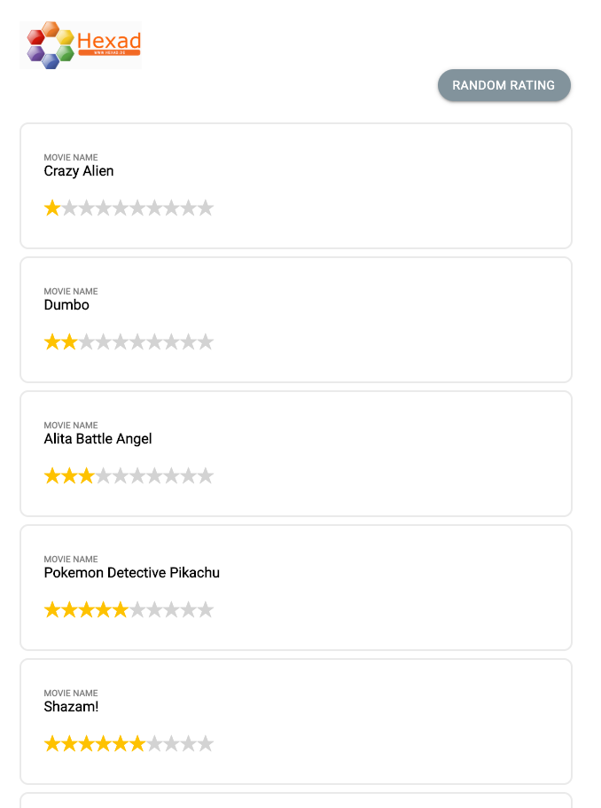

# Favourite Movies List Component (React, Redux)

### Set Up
Below are the steps to get it running.

 - Install all the dependencies in the application by using the command ``` npm install ```
 - Then start the application in another terminal by using command ``` npm start ```
 - Run the tests using command ``` npm test ```

## Summary


##### Custom Middleware
Created the custom middleware to handle the all API requests in the application with common action, instead of creating different API calls in action creators.
 
- This will allow us to handle loading spinner/loader globally across the application when handling with different API calls.
- Action creators can be easily tested as all async calls will be handled in custom middleware.
- Code in the action creator is clean and uniform.
- When application is becoming bigger, we can handle all API calls across the application easily with clean code.

### Sample screens



